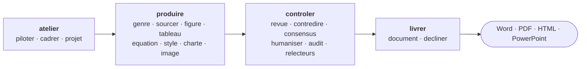

  

  
  
  
  
  
  

<b>Décrivez la cible. Scriptorium cadre, source, rédige, révise et met en forme un document rigoureux, sous le contrôle de garde-fous déterministes.</b>

Scriptorium est un plugin Claude (Cowork et Claude Code) qui transforme une demande de rédaction en document fini. Il applique une méthodologie d'ingénierie textuelle, déplace la rigueur vérifiable du jugement du modèle vers dix-huit scripts déterministes, et impose un style maison à directives strictes. Quatre compétences couvrent le cycle de vie complet, du cadrage à la livraison.

## Comment ça marche

Deux moteurs travaillent ensemble. Le modèle tranche le jugement : rédiger, classer, résumer, décrire une image, formuler une contre-thèse. Le code tranche le mécanique et le reproductible : détecter un tiret cadratin, nettoyer une URL, noter un document sur cent, lire les dimensions d'une image. Une affirmation majeure sans preuve cartographiée est affaiblie ou retirée, c'est une contrainte dure et non une préférence.

## Installation

Télécharger `scriptorium-0.6.0.plugin` depuis la [page des releases](https://github.com/MariusYvard/Scriptorium/releases), puis l'installer.

- Cowork : ouvrir le fichier `.plugin` et accepter l'installation.
- Claude Code : `/plugin marketplace add MariusYvard/Scriptorium`, puis installer le plugin `scriptorium`.

Les compétences apparaissent sous le préfixe `scriptorium:`. Les scripts et le harnais d'évaluation tournent en Python sans dépendance (`python3 evals/run-evals.py`).

## Les quatre compétences

| Compétence | Sous-commandes | Rôle |
| --- | --- | --- |
| `atelier` | piloter · cadrer · projet | Point d'entrée. Orchestre la production de A à Z, cadre le sujet, garde le contexte du projet entre les sessions. |
| `produire` | genre · sourcer · revue-litterature · figure · tableau · equation · style · charte · image | Produit le contenu et fixe la forme. Rédige les six genres, trouve et vérifie les sources, génère figures et tableaux, pose les équations, applique style et charte, extrait les images d'un document source. |
| `controler` | revue · contredire · consensus · humaniser · audit · relecteurs | Éprouve un écrit. Revue adversariale, contradiction par le modèle de Toulmin, vote de consensus, détection d'empreinte IA, audit d'un document existant, réponse aux relecteurs. |
| `livrer` | document · decliner | Met en forme le livrable (Word, PDF, HTML) et le décline par canal (présentation, résumé, abstract, post, communiqué). |

Chaque sous-commande charge à la demande son fichier de référence, le contexte reste léger. Décrire la cible suffit à déclencher la bonne action ; il est aussi possible de nommer l'action, par exemple `produire figure`.

## En une demande

> « Rédige une analyse stratégique de 20 pages sur le marché X pour mon comité de direction, avec un SWOT et un PESTEL. »

`atelier` enchaîne le cadrage (problématique fermée, plan validé), le sourcing (sources pondérées, carte preuve-affirmation), la rédaction déléguée section par section à l'agent `redacteur`, les figures SWOT et PESTEL produites en SVG, la revue adversariale, puis la mise en forme à la charte. Trois points de contrôle reviennent vers vous : le périmètre, la suffisance des preuves, le verdict de révision.

## Garde-fous déterministes

Dix-huit scripts en Python pur déplacent la rigueur du jugement du modèle vers un contrôle mécanique et reproductible. Une porte d'intégration continue (`tools/check.py`) verrouille un document contre un seuil de note.

| Script | Ce qu'il attrape |
| --- | --- |
| `lint-style.py` | Tiret cadratin, typographie courbe, lexique promotionnel, virgule d'Oxford, métadiscours, paramètres de suivi. |
| `verify-sources.py` | URL à nettoyer, doublons, DOI douteux. |
| `scorecard.py` | Note déterministe de 0 à 100 sur cinq axes, calcul montré, verdict. |
| `traceability.py` | Références orphelines ou pendantes, appels de figures et de tableaux. |
| `ai-fingerprint.py` | Rythme uniforme, ouvertures répétées, cadence ternaire, connecteurs suremployés. |
| `numbers.py` | Pourcentages impossibles, partitions qui ne somment pas, séparateur décimal mixte. |
| `theme.py` | Validation de charte, contraste WCAG, émission du CSS du HTML. |
| `images.py` | Extraction d'images (Office, PDF), déduplication, dimensions, manifeste. |

Le catalogue complet est dans [`scripts/README.md`](scripts/README.md). Un hook lance le linter après chaque écriture et bloque la finalisation tant qu'un écart critique subsiste.

## Six genres

Rapport scientifique et mémoire (IMRAD, APA 7 ou Vancouver), article, long rapport professionnel, analyse stratégique (SWOT, PESTEL, 5 forces de Porter, BCG, Mactor, Ansoff), rapport de prospective (signaux faibles, scénarios contrastés), étude de cas d'affaires.

## Trois publics

| Public | Genres de prédilection |
| --- | --- |
| Chercheur | Rapport scientifique IMRAD, article, revue de littérature. |
| Ingénieur | Long rapport technique, étude de cas, rapport d'essais, équations et unités SI. |
| Analyste géopolitique | Analyse stratégique (jeu d'acteurs Mactor, PESTEL), rapport de prospective. |

La méthode et le style maison ne changent pas, seuls le genre et les exemples s'adaptent au domaine.

## Formats de sortie

Le format de travail est le Markdown. La finalisation produit un document Word (`.docx`), un PDF, un HTML autonome dont le CSS dérive de la charte graphique (jetons, focus visible, feuille d'impression, source idéale pour un PDF fidèle), ou une présentation PowerPoint. Les figures sortent en SVG, les tableaux en Markdown, les équations en PDF via LaTeX, et les images d'un document source sont extraites puis replacées, numérotées et à la charte.

## Style maison

Le style par défaut applique des directives strictes : registre encyclopédique et neutre, zéro tiret cadratin, pas de virgule d'Oxford, guillemets et apostrophes droits, lexique promotionnel banni, faits précis ou rien, sources vérifiées sans paramètres de suivi. Il vit dans [`skills/produire/references/directives-strictes.md`](skills/produire/references/directives-strictes.md) et le linter applique les mêmes règles. La compétence `produire` (style) peut régénérer une charte à partir de vos écrits.

## Agents délégués

Le travail lourd est confié à cinq agents lancés via l'outil Task : `redacteur` (rédaction long-format), `controle-qualite` (validation structurée), `synthese-sources` (recherche et triangulation), `contradicteur` (contre-thèse), `verificateur-faits` (vérification factuelle).

## Évaluations et release

`evals/run-evals.py` relie des cas piégés à des attentes précises et vérifie que les garde-fous attrapent ce qu'ils doivent (37 cas). La publication est automatisée : un tag `vX.Y.Z` déclenche la vérification des versions, les evals, la construction du `.plugin` et la création de la Release. Voir [`docs/RELEASE.md`](docs/RELEASE.md) et [`CHANGELOG.md`](CHANGELOG.md).

## Licence

MIT. Voir [`LICENSE`](LICENSE).
