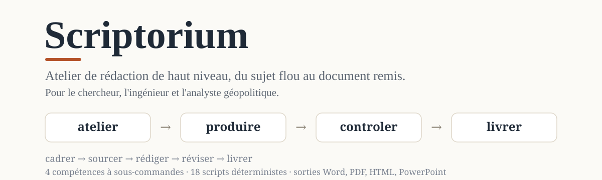
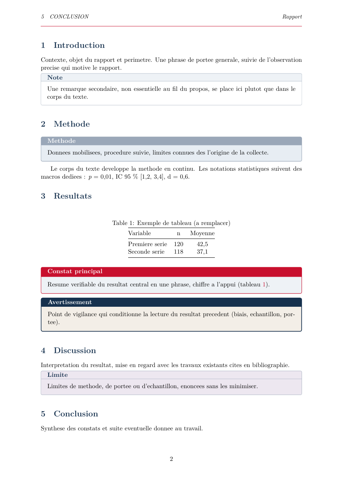
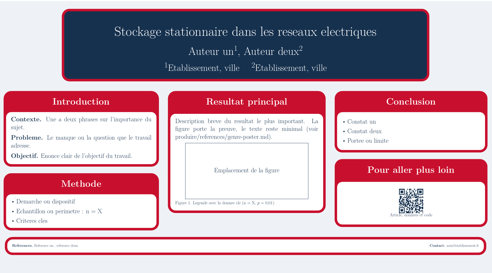
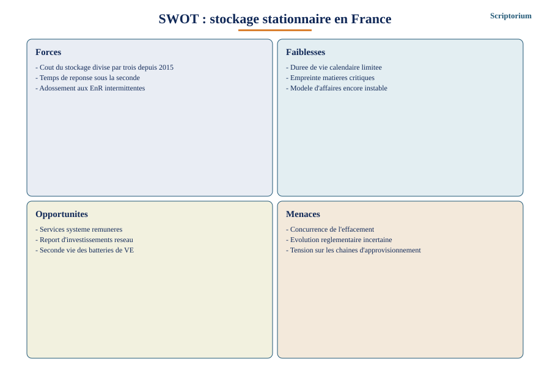
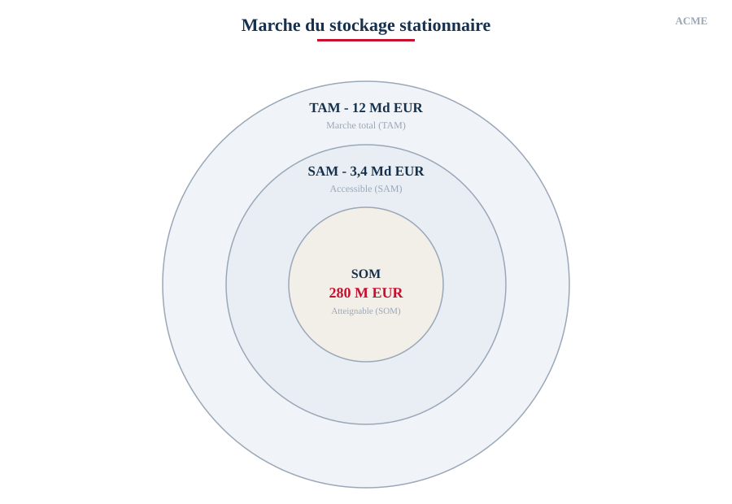
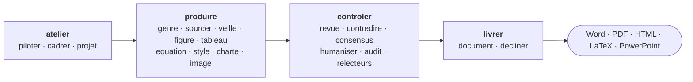

<p align="center">
  
</p>

<p align="center">
  <a href="https://github.com/MariusYvard/Scriptorium/actions/workflows/evals.yml"></a>
  <a href="https://github.com/MariusYvard/Scriptorium/releases"></a>
  <a href="https://github.com/MariusYvard/Scriptorium/releases/latest"></a>
  
  
  
</p>

<p align="center"><b>Décrivez la cible. Scriptorium cadre, source, rédige, révise et met en forme un document rigoureux, sous le contrôle de garde-fous déterministes.</b></p>

Scriptorium est un plugin Claude (Cowork et Claude Code) qui transforme une demande de rédaction en document fini : rapport, article, analyse stratégique, note juridique, poster scientifique. Il s'appuie sur vingt-six genres adossés à des sources faisant autorité, vingt scripts de contrôle en Python pur et un style maison à directives strictes. Le modèle rédige et juge, le code mesure et vérifie.

## Ce que ça produit

Tout ce qui suit sort du plugin, sans retouche : le rapport et le poster sont les gabarits LaTeX livrés, compilés avec la charte graphique d'exemple ; les figures sont générées par `figures.py`.

| Rapport LaTeX charté | Poster scientifique |
| :---: | :---: |
|  |  |

| Figure SWOT | Figure TAM, SAM, SOM |
| :---: | :---: |
|  |  |

Et chaque document passe au scorecard avant livraison. Sortie réelle sur le texte de démonstration :

```text
Scorecard : 92/100, verdict Pret | seuil rapport 80/100 : atteint

  Style                      20/20  ##############################
  Sources                    20/20  ##############################
  Tracabilite                20/20  ##############################
  Terminologie et nombres    12/20  ##################............
      -8 sigle non defini (x3)
  Lisibilite                 20/20  ##############################

  Force(s) : Style, Sources, Tracabilite, Lisibilite (20/20)
  Faiblesse(s) : Terminologie et nombres (12/20)
```

## Démarrer en une minute

1. Télécharger `scriptorium-X.Y.Z.plugin` depuis la [page des releases](https://github.com/MariusYvard/Scriptorium/releases/latest).
2. Cowork : ouvrir le fichier `.plugin` et accepter l'installation. Claude Code : `/plugin marketplace add MariusYvard/Scriptorium` puis installer `scriptorium`.
3. Demander, par exemple :

> « Rédige une analyse stratégique de 20 pages sur le marché X pour mon comité de direction, avec un SWOT et un PESTEL. »

`atelier` enchaîne le cadrage (problématique fermée, plan validé), le sourcing (sources pondérées et triangulées, carte preuve-affirmation), la rédaction section par section, les figures en SVG, la revue adversariale, puis la mise en forme à la charte. Trois points de contrôle reviennent vers vous : le périmètre, la suffisance des preuves, le verdict de révision. Les scripts et le harnais d'évaluation tournent en Python sans dépendance (`python3 evals/run-evals.py`).

## Comment ça marche



Deux moteurs travaillent ensemble. Le modèle tranche le jugement : rédiger, classer, résumer, décrire une image, formuler une contre-thèse. Le code tranche le mécanique et le reproductible : détecter un tiret cadratin, trianguler un DOI contre trois index, noter un document sur cent, suivre la trajectoire d'une note entre deux revues. Une affirmation majeure sans preuve cartographiée est affaiblie ou retirée, c'est une contrainte dure et non une préférence.

| Compétence | Sous-commandes | Rôle |
| --- | --- | --- |
| `atelier` | piloter · cadrer · projet | Point d'entrée. Orchestre la production de A à Z avec bilan de fin de mission, qualifie le sujet (cadre FINER, dialogue socratique), tient le journal de projet entre les sessions (frontières, reprise par hash, tableau de bord). |
| `produire` | genre · sourcer · revue-litterature · veille · figure · tableau · equation · style · charte · image | Produit le contenu et fixe la forme. Rédige les vingt-six genres, triangule les sources, met en place une veille, génère figures et tableaux, applique style et charte. |
| `controler` | revue · contredire · consensus · humaniser · audit · relecteurs | Éprouve l'écrit. Revue à huit dimensions, contradiction disciplinée, consensus sur contrat de notation préenregistré, empreinte IA, audit d'un document ou d'un deck, réponse aux relecteurs avec trajectoire de score. |
| `livrer` | document · decliner | Met en forme (Word, PDF, HTML, LaTeX charté) et décline par canal (présentation, poster, résumé bilingue FR/EN, abstract, post, communiqué). |

Chaque sous-commande charge à la demande son fichier de référence, le contexte reste léger. Décrire la cible suffit ; il est aussi possible de nommer l'action, par exemple `produire figure`.

## Garde-fous déterministes

Vingt scripts en Python pur (aucune dépendance) déplacent la rigueur du jugement du modèle vers un contrôle mécanique et reproductible. Une porte d'intégration continue (`tools/check.py`) verrouille un document contre un seuil de note ; passer outre exige une justification à friction croissante, journalisée.

<details>
<summary><b>Les vingt scripts, en une ligne chacun</b></summary>

| Script | Ce qu'il attrape ou produit |
| --- | --- |
| `lint-style.py` | Tiret cadratin, typographie courbe, lexique promotionnel, virgule d'Oxford, métadiscours, paramètres de suivi. |
| `verify-sources.py` | URL à nettoyer, doublons, DOI douteux, palier de source par domaine ; en option réseau, triangulation Crossref, OpenAlex et Semantic Scholar avec verdicts gradués. |
| `citations.py` | Cinq formats (APA 7, Vancouver, Chicago, MLA, IEEE), bascule entre formats, ancres par citation, validation de champs, résolution DOI, PMID et arXiv. |
| `check-temporel.py` | Futur présenté comme passé, inversion causale, version anachronique, langage à péremption. |
| `check-presentation.py` | Deck PDF : pages par durée annoncée, densité de texte, backends optionnels, jamais de mesure inventée. |
| `scorecard.py` | Note de 0 à 100 sur cinq axes, barres ASCII, plancher par axe, poids externes, seuils par type de document, décision éditoriale, trajectoire entre deux revues. |
| `traceability.py` | Références orphelines ou pendantes, appels de figures et tableaux, tags de lacune normalisés. |
| `ai-fingerprint.py` | Rythme uniforme, ouvertures répétées, cadence ternaire, connecteurs suremployés. |
| `coherence.py` | Paragraphes quasi dupliqués, phrases répétées, promesses non tenues. |
| `terminology.py` | Sigles non définis ou employés avant définition, variantes d'un même terme. |
| `numbers.py` | Pourcentages impossibles, partitions qui ne somment pas, séparateur décimal mixte. |
| `readability.py` | Longueurs de phrase et de paragraphe, densité lexicale, indice LIX. |
| `figures.py` | SWOT, BCG, Ansoff, PESTEL, chaîne de valeur, TAM-SAM-SOM en SVG, avec audit structurel. |
| `tables.py` | Génération de tableaux depuis CSV ou JSON, audit des tableaux d'un document. |
| `theme.py` | Validation de charte, contraste WCAG, palettes daltonisme-sûres, CSS et préambule LaTeX. |
| `images.py` | Extraction d'images (Office, PDF), déduplication, dimensions, manifeste. |
| `plan-check.py` | Conformité du document au plan validé. |
| `diff-versions.py` | Journal des écarts entre deux versions. |
| `project.py` | Journal de mission append-only, frontières à hash, reprise unique, états d'étapes, tableau de bord. |
| `audit-doc.py` | Audit consolidé en une commande. |

</details>

Un hook lance le linter après chaque écriture et bloque la finalisation tant qu'un écart critique subsiste. Le catalogue détaillé est dans [`scripts/README.md`](scripts/README.md).

## L'intégrité des sources, au sérieux

La vérification d'une source va plus loin que l'existence d'une URL. Triangulation multi-index avec verdicts gradués par référence (vérifié, plausible, invérifiable, fabriqué), ancre par citation (citation exacte ou localisation précise), contrôle chronologique des affirmations causales datées, tags de lacune normalisés (`[LACUNE MATERIELLE]`, `[PREUVE FAIBLE]`) comptés par le linter, hiérarchie de preuve à sept niveaux, fiche source A-F, standards de compte rendu EQUATOR aux comptes vérifiés. Une bibliothèque personnelle fournie (BibTeX, Zotero) est pré-criblée aux mêmes critères que les sources externes, sans rien écarter en silence.

Le comité de revue suit la même discipline : trois agents votent sur contrat de notation préenregistré avant lecture, aucune moyenne ne masque un désaccord, aucun verdict n'est montré aux voix qui n'ont pas voté, un axe effondré plafonne la décision, et la re-revue suit la trajectoire de score axe par axe.

## Vingt-six genres, quatorze publics

Chaque genre est adossé à des sources citées dans son playbook (`skills/produire/references/genre-*.md`).

<details>
<summary><b>Les genres par famille</b></summary>

- Académique et recherche : rapport scientifique et mémoire (IMRAD), article, revue de littérature (PRISMA), demande de financement, dissertation et commentaire.
- Entreprise et conseil : long rapport décisionnel, analyse stratégique (SWOT, PESTEL, 5 forces, Mactor), prospective, étude de cas, business plan, étude de marché, proposition commerciale et réponse à appel d'offres.
- Technique : cahier des charges et spécification (IEEE 29148), documentation technique (Diátaxis), rapport d'incident et post-mortem.
- Finance : note d'analyse financière et mémo d'investissement.
- Public et droit : note de politique publique, rapport d'évaluation (OCDE/CAD), note et consultation juridique (IRAC), conclusions contentieuses, contrat.
- Santé : cas clinique et protocole de recherche (CARE, CONSORT, STROBE, PRISMA).
- Communication : livre blanc, discours, présentation (soutenance), pitch, poster scientifique.

</details>

<details>
<summary><b>Les publics et leurs genres de prédilection</b></summary>

| Public | Genres de prédilection |
| --- | --- |
| Chercheur | Rapport scientifique IMRAD, article, revue de littérature, poster. |
| Ingénieur | Cahier des charges, documentation technique, post-mortem, étude de cas. |
| Analyste géopolitique | Analyse stratégique, prospective, note de politique publique. |
| Juriste | Note et consultation juridique (IRAC), conclusions, contrat. |
| Professionnel de santé | Cas clinique, protocole de recherche. |
| Consultant et dirigeant | Long rapport décisionnel, analyse stratégique, business plan. |
| Communicant | Livre blanc, article, présentation, étude de marché. |
| Étudiant | Dissertation, mémoire, présentation de soutenance, poster. |
| Analyste financier | Note d'analyse financière, mémo d'investissement. |
| Entrepreneur | Business plan, étude de marché, proposition commerciale, pitch. |
| Enseignant | Support de cours, dissertation, présentation. |
| Chef de projet | Cahier des charges, proposition commerciale, rapport d'évaluation. |
| Agent public | Note de politique publique, rapport d'évaluation. |
| Journaliste | Article, enquête, tribune. |

</details>

La méthode et le style maison ne changent pas, seuls le genre et les exemples s'adaptent. Les profils de discipline (voir `controler` consensus) calibrent la norme de citation et le seuil d'exigence.

## Style maison

Le style par défaut applique des directives strictes : registre encyclopédique et neutre, zéro tiret cadratin, pas de virgule d'Oxford, guillemets droits, lexique promotionnel banni, faits précis ou rien, sources vérifiées sans paramètres de suivi. Il vit dans [`skills/produire/references/directives-strictes.md`](skills/produire/references/directives-strictes.md) et le linter applique les mêmes règles. La compétence `produire` (style) peut aussi calibrer un style personnel sur des échantillons fournis, toujours subordonné au style maison et aux conventions de la discipline.

## Qualité, évaluations, releases

Le harnais (`evals/run-evals.py`, 92 cas) relie des fixtures piégées à des attentes exactes : règles du linter, verdicts des scripts, et cohérence du plugin lui-même (chaque référence citée par un routeur existe, chaque playbook porte sa section Sources, aucun chemin périmé). La publication est automatisée : un tag `vX.Y.Z` vérifie les versions, rejoue les evals, construit le `.plugin` et crée la Release. Voir [`docs/RELEASE.md`](docs/RELEASE.md), [`docs/CONCEPTION.md`](docs/CONCEPTION.md) et le [`CHANGELOG.md`](CHANGELOG.md).

## Contribuer

Les issues et propositions sont bienvenues, en français ou en anglais : signalement d'un faux positif d'un script, genre manquant, source à corriger. Les règles du dépôt (style maison sur tout texte, scripts sans dépendance, evals au vert) tiennent dans [`CONTRIBUTING.md`](CONTRIBUTING.md).

## Inspirations

Les principes de conception sont documentés dans [`docs/CONCEPTION.md`](docs/CONCEPTION.md). Des mécanismes d'intégrité et de revue réimplémentent à neuf des idées observées dans [academic-research-skills](https://github.com/Imbad0202/academic-research-skills) de Cheng-I Wu (CC BY-NC 4.0, zéro texte repris) ; la version 0.8.0 adapte du code et des gabarits du projet [openscience](https://github.com/synthetic-sciences/openscience) de Synthetic Sciences (Apache-2.0, attribution en tête de chaque fichier concerné). Les standards cités (PRISMA, CRediT, GRADE, EQUATOR, Bradford Hill) le sont depuis leurs sources primaires.

## Licence

MIT. Voir [`LICENSE`](LICENSE).
